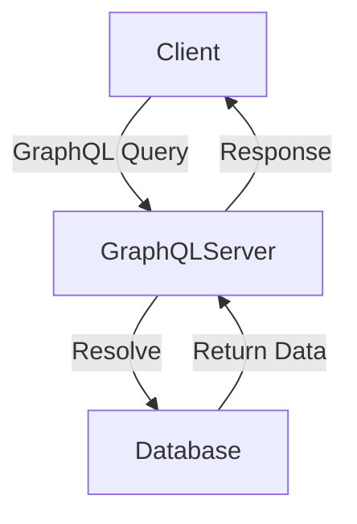

# GraphQL

GraphQL — это язык запросов и среда выполнения для API, разработанный Facebook (ныне Meta) в 2015 году. Он позволяет клиенту запрашивать только необходимые данные, минимизируя объем передаваемой информации. Это делает GraphQL более гибким и эффективным по сравнению с REST.  

## Основные концепции GraphQL  

GraphQL API строится на основе схемы, определяющей, какие данные доступны и какие операции можно выполнять. Основные компоненты GraphQL:  

- **Схема (Schema)** — описание доступных типов данных и их связей  
- **Типы (Types)** — структуры данных, доступные в API  
- **Запросы (Queries)** — получение данных  
- **Мутации (Mutations)** — внесение изменений в данные  
- **Подписки (Subscriptions)** — получение обновлений в реальном времени  

### Основные принципы GraphQL  

- **Декларативность** — клиент указывает, какие данные ему нужны, а сервер возвращает только их  
- **Гибкость** — запрос может включать различные сущности в одном вызове  
- **Типизированность** — схема определяет строгие типы данных  
- **Один эндпоинт** — вся работа ведется через единый HTTP-эндпоинт  

## Типы данных в GraphQL  

GraphQL использует строгую систему типов для описания данных, доступных через API.  

### Встроенные типы  

GraphQL предоставляет несколько базовых типов:  

- **Int** — целочисленное значение  
- **Float** — число с плавающей запятой  
- **String** — строка  
- **Boolean** — булево значение (`true` или `false`)  
- **ID** — уникальный идентификатор, представленный строкой  
- **List** (`[Type]`) — массив значений определенного типа  

Пример использования базовых типов:  

```graphql
type User {
  id: ID!
  name: String!
  age: Int
  email: String!
}
```

### Пользовательские типы  

GraphQL позволяет создавать собственные типы данных и определять связи между ними.  

```graphql
type Post {
  id: ID!
  title: String!
  content: String!
  author: User!
}
```

Здесь определен тип `Post`, который включает связь `author` с типом `User`.  

### Обязательные и необязательные поля  

- `String!` — поле обязательно  
- `String` — поле необязательно  

Если в схеме поле объявлено как `String!`, сервер должен обязательно вернуть значение, иначе произойдет ошибка выполнения запроса.  

## Запросы (Queries) в GraphQL  

Запросы в GraphQL позволяют клиенту получать только нужные данные.  

### Пример запроса  

```graphql
query {
  user(id: "1") {
    name
    email
    posts {
      title
    }
  }
}
```

Сервер вернет:  

```json
{
  "data": {
    "user": {
      "name": "Иван",
      "email": "ivan@example.com",
      "posts": [
        { "title": "Первая статья" },
        { "title": "Вторая статья" }
      ]
    }
  }
}
```

### Запрос с аргументами  

В GraphQL можно передавать аргументы для фильтрации данных:  

```graphql
query {
  post(id: "10") {
    title
    content
  }
}
```

## Мутации (Mutations) в GraphQL  

Мутации используются для создания, обновления и удаления данных.  

### Пример мутации  

```graphql
mutation {
  createPost(input: { title: "Новая статья", content: "Текст статьи", authorId: "1" }) {
    id
    title
  }
}
```

Ответ сервера:  

```json
{
  "data": {
    "createPost": {
      "id": "101",
      "title": "Новая статья"
    }
  }
}
```

### Обновление данных  

```graphql
mutation {
  updatePost(id: "101", input: { title: "Обновленный заголовок" }) {
    id
    title
  }
}
```

### Удаление данных  

```graphql
mutation {
  deletePost(id: "101") {
    id
  }
}
```

## Подписки (Subscriptions) в GraphQL  

Подписки позволяют получать обновления в реальном времени при изменении данных.  

```graphql
subscription {
  postCreated {
    id
    title
  }
}
```

Сервер отправит уведомление клиенту, когда появится новый пост.  

## Архитектура GraphQL API  

В традиционном REST API клиент делает запрос к определенному URL и получает предопределенные данные. В GraphQL клиент делает запрос к единому эндпоинту, указывая, какие данные ему нужны.  

### Диаграмма архитектуры GraphQL  



### Жизненный цикл запроса  

1. Клиент отправляет запрос с определением нужных данных  
2. GraphQL-сервер обрабатывает запрос, используя резолверы  
3. Сервер запрашивает данные из базы данных  
4. Сервер возвращает ответ клиенту  

## Отличия GraphQL от REST  

| Функциональность | REST | GraphQL |
|-----------------|------|---------|
| Запрос данных | Фиксированные эндпоинты | Один универсальный эндпоинт |
| Избыточность данных | Может быть высокой | Минимальна |
| Гибкость запроса | Низкая | Высокая |
| Поддержка подписок | Ограничена | Встроенная |
| Версионирование API | Требуется | Не требуется |

### Основные преимущества GraphQL  

- Запрос данных с точностью до поля  
- Гибкость и мощные возможности фильтрации  
- Упрощенное управление зависимостями  
- Поддержка подписок  

### Недостатки GraphQL  

- Усложнение кеширования запросов  
- Необходимость написания сложных резолверов  
- Высокая нагрузка на сервер при сложных запросах  

## Пример сервера на GraphQL  

Используя Node.js и библиотеку Apollo Server, можно создать GraphQL-сервер.  

```javascript
const { ApolloServer, gql } = require("apollo-server");

const typeDefs = gql`
  type User {
    id: ID!
    name: String!
    email: String!
  }

  type Query {
    users: [User]
  }
`;

const resolvers = {
  Query: {
    users: () => [{ id: "1", name: "Иван", email: "ivan@example.com" }]
  }
};

const server = new ApolloServer({ typeDefs, resolvers });

server.listen().then(({ url }) => {
  console.log(`🚀 Server ready at ${url}`);
});
```

## Заключение  

GraphQL — это мощный инструмент для создания API, который позволяет клиенту запрашивать только необходимые данные. Он гибче и эффективнее REST, но требует продуманного подхода к кешированию и безопасности.  
