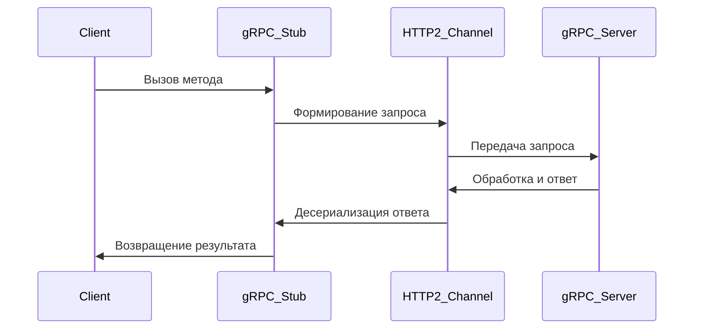
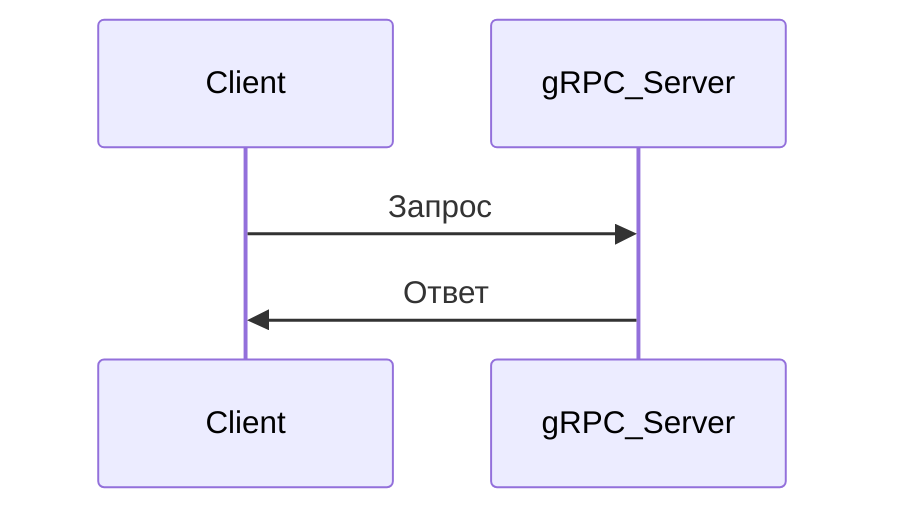
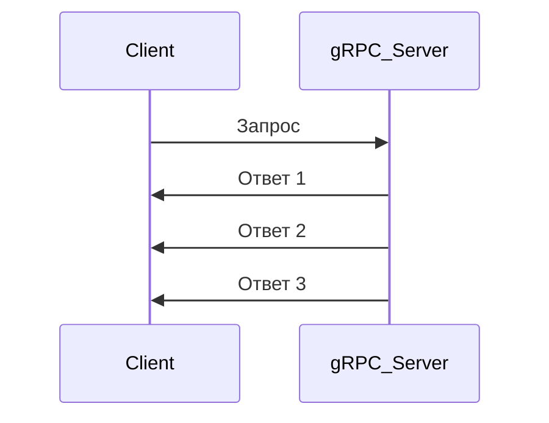
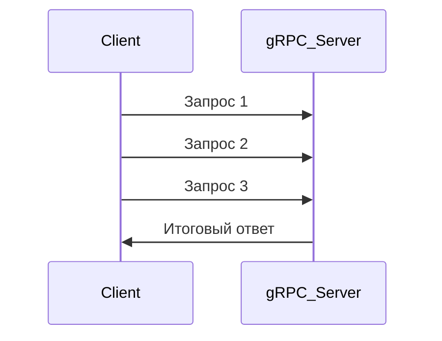
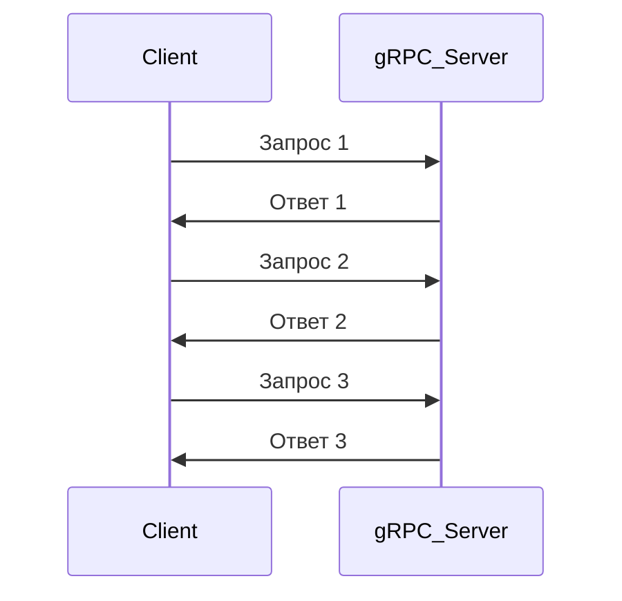

# gRPC

gRPC (Google Remote Procedure Call) — это современный высокопроизводительный фреймворк для удаленного вызова процедур (**Remote Procedure Call, RPC**), разработанный Google. Он предназначен для эффективного обмена данными между сервисами в распределенных системах и использует **HTTP/2**, **Protocol Buffers (Protobuf)** и **стриминг**.  

## Архитектура и принцип работы gRPC

gRPC основан на концепции удаленного вызова процедур (**RPC**), что позволяет клиенту вызывать методы на удаленном сервере так, будто они являются локальными. При этом взаимодействие происходит по протоколу **HTTP/2**, а данные сериализуются с помощью **Protobuf (Protocol Buffers)**.

### Основные компоненты

- **Клиент (Client)** — отправляет gRPC-запрос к серверу и получает ответ.
- **Сервер (Server)** — обрабатывает запрос, выполняет бизнес-логику и возвращает ответ.
- **Stub (Клиентская обёртка)** — автоматически сгенерированный код, который преобразует локальный вызов в сетевой.
- **Channel (Канал связи)** — соединение между клиентом и сервером через HTTP/2.
- **Interceptors (Перехватчики)** — middleware-слои для добавления логирования, аутентификации и других функций.

### Диаграмма взаимодействия

## Протокол HTTP/2 в gRPC

gRPC полностью основывается на **HTTP/2**, который значительно эффективнее **HTTP/1.1**, используемого в REST.  

### Преимущества HTTP/2

1. **Мультиплексирование** – позволяет передавать несколько запросов и ответов в одном соединении без блокировки.
2. **Сжатие заголовков (HPACK)** – уменьшает объем передаваемых метаданных.
3. **Двухсторонний стриминг** – поддержка асинхронного обмена данными.
4. **Серверный push** – сервер может отправлять клиенту данные без явного запроса.
5. **Поддержка TLS** – gRPC требует защищенного соединения по умолчанию.

## Protocol Buffers (Protobuf)

**Protocol Buffers (protobuf)** – это бинарный формат сериализации данных, используемый в gRPC. Он компактнее и быстрее, чем JSON и XML.

### Основные преимущества

- **Меньший размер данных** (экономия трафика).
- **Более высокая скорость десериализации**.
- **Поддержка строгой типизации**.
- **Языконезависимая схема** (генерация кода для разных языков).

### Основные элементы Protobuf

- **message** – описание структуры данных.
- **service** – определение сервиса и его методов.
- **rpc** – описание удаленного метода.

## Типы gRPC-вызовов

gRPC поддерживает **четыре** типа взаимодействия между клиентом и сервером.

### Обычный вызов (Unary RPC)

Клиент отправляет **один запрос** и получает **один ответ**.

### Серверный стриминг (Server Streaming RPC)

Клиент отправляет **один запрос**, сервер отправляет **много ответов**.

### Клиентский стриминг (Client Streaming RPC)

Клиент отправляет **несколько запросов**, сервер возвращает **один ответ**.

### Двунаправленный стриминг (Bidirectional Streaming RPC)

Клиент и сервер **обмениваются данными асинхронно**.

## Аутентификация и безопасность

gRPC по умолчанию использует **TLS**, обеспечивая безопасную передачу данных. Также поддерживаются:

- **JWT (JSON Web Tokens)**.
- **OAuth2**.
- **API-ключи**.
- **LDAP и mTLS (Mutual TLS)**.

## Балансировка нагрузки

gRPC поддерживает несколько стратегий балансировки:

1. **Round Robin** – циклическое распределение запросов между серверами.
2. **Least Connections** – отправка запроса серверу с наименьшей загрузкой.
3. **Consistent Hashing** – привязка клиентов к конкретному серверу.

## Преимущества gRPC перед REST

| Фактор               | gRPC | REST (HTTP/1.1) |
|----------------------|------|----------------|
| **Протокол**        | HTTP/2 | HTTP/1.1 |
| **Формат данных**   | Protobuf (бинарный) | JSON/XML (текстовый) |
| **Скорость**        | Быстрее | Медленнее |
| **Размер сообщений** | Меньше | Больше |
| **Поддержка стриминга** | Да | Ограниченная |
| **Сжатие заголовков** | Да (HPACK) | Нет |
| **Мультиплексирование** | Да | Нет |

## Недостатки gRPC

- **Сложность отладки** (из-за бинарного формата Protobuf).
- **Ограниченная поддержка в браузерах** (так как gRPC использует HTTP/2, браузеры могут не поддерживать прямые вызовы).
- **Крутая кривая обучения** (нужно освоить Protobuf, gRPC API и принципы работы HTTP/2).

## Когда использовать gRPC?

### gRPC **лучше всего подходит** для

- Высоконагруженных микросервисов.  
- Взаимодействия между сервисами в разных языках.  
- Стриминговых и real-time приложений.  
- Мобильных и IoT-приложений (из-за низкой нагрузки на сеть).  

### REST **остается актуальным** для

- Веб-приложений (из-за лучшей поддержки браузерами).  
- Открытых API (REST проще интегрировать).  
- Простых сервисов, где скорость не критична.  

## Итог

gRPC — это мощный инструмент для высокопроизводительных распределённых систем. Он быстрее REST, поддерживает стриминг и эффективнее использует сетевые ресурсы благодаря HTTP/2. Однако он сложнее в настройке и не всегда удобен для веб-клиентов.
