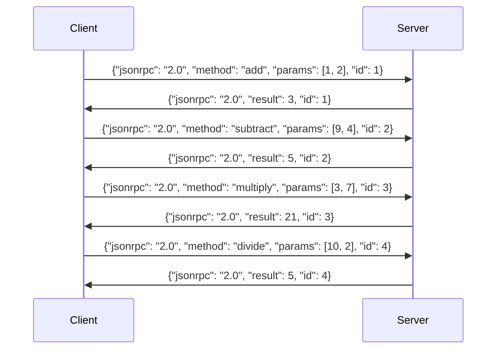

# JSON-RPC

**JSON-RPC** — это протокол удалённого вызова процедур (RPC), который использует формат данных **JSON** (JavaScript Object Notation) для передачи сообщений между клиентом и сервером. JSON-RPC является лёгким и независимым от языка программирования протоколом, предоставляющим стандартизированный способ для обмена данными и выполнения удалённых вызовов процедур.

В отличие от других RPC-протоколов, таких как XML-RPC, JSON-RPC работает исключительно с JSON, что делает его простым, гибким и эффективным для интеграции в различные системы и приложения.

## Структура JSON-RPC

Каждое сообщение в JSON-RPC, будь то запрос или ответ, представляет собой объект в формате JSON. Протокол использует следующие основные элементы:

1. **`jsonrpc`** — версия протокола. На данный момент поддерживается версия `"2.0"`.
2. **`method`** — имя вызываемой процедуры или метода на сервере.
3. **`params`** — (необязательный) список параметров, передаваемых в метод.
4. **`id`** — (необязательный) уникальный идентификатор, позволяющий связать запрос и ответ.

## Структура запроса

Запрос JSON-RPC может выглядеть следующим образом:

```json
{
  "jsonrpc": "2.0",
  "method": "add",
  "params": [1, 2],
  "id": 1
}
```

- **`jsonrpc`**: Указывает на версию протокола (в данном случае `"2.0"`).
- **`method`**: Имя метода или процедуры, который нужно вызвать на сервере (в данном случае метод `"add"`).
- **`params`**: Список аргументов, передаваемых в метод (например, `[1, 2]` для метода сложения).
- **`id`**: Уникальный идентификатор запроса, который помогает связать запрос с ответом. Этот идентификатор может быть любым строковым или числовым значением, например, `1`.

## Структура ответа

Ответ на запрос состоит из следующих полей:

```json
{
  "jsonrpc": "2.0",
  "result": 3,
  "id": 1
}
```

- **`jsonrpc`**: Версия протокола (в данном случае `"2.0"`).
- **`result`**: Результат выполнения метода. Это может быть любое значение, которое метод возвращает (например, результат сложения).
- **`error`**: (необязательное) описание ошибки, если она произошла.
- **`id`**: Идентификатор запроса, которому соответствует данный ответ. Это важно для того, чтобы связать запрос с его результатом.

Если произошла ошибка, то в ответе будет присутствовать поле **`error`**:

```json
{
  "jsonrpc": "2.0",
  "error": {
    "code": -32602,
    "message": "Invalid params"
  },
  "id": 1
}
```

- **`code`**: Код ошибки, определяющий тип ошибки (например, `-32602` для ошибки с параметрами).
- **`message`**: Описание ошибки.
- **`id`**: Идентификатор запроса, к которому относится ошибка.

## Методы JSON-RPC

Протокол JSON-RPC поддерживает вызов различных методов на сервере. Например:

1. **`add`** — складывает два числа.
2. **`subtract`** — вычитает одно число из другого.
3. **`multiply`** — умножает два числа.
4. **`divide`** — делит одно число на другое.

### Пример запросов и ответов

1. **Сложение**:
    - Запрос:

      ```json
      {
        "jsonrpc": "2.0",
        "method": "add",
        "params": [5, 7],
        "id": 1
      }
      ```

    - Ответ:

      ```json
      {
        "jsonrpc": "2.0",
        "result": 12,
        "id": 1
      }
      ```

2. **Вычитание**:
    - Запрос:

      ```json
      {
        "jsonrpc": "2.0",
        "method": "subtract",
        "params": [9, 4],
        "id": 2
      }
      ```

    - Ответ:

      ```json
      {
        "jsonrpc": "2.0",
        "result": 5,
        "id": 2
      }
      ```

3. **Умножение**:
    - Запрос:

      ```json
      {
        "jsonrpc": "2.0",
        "method": "multiply",
        "params": [3, 7],
        "id": 3
      }
      ```

    - Ответ:

      ```json
      {
        "jsonrpc": "2.0",
        "result": 21,
        "id": 3
      }
      ```

4. **Деление**:
    - Запрос:

      ```json
      {
        "jsonrpc": "2.0",
        "method": "divide",
        "params": [10, 2],
        "id": 4
      }
      ```

    - Ответ:

      ```json
      {
        "jsonrpc": "2.0",
        "result": 5,
        "id": 4
      }
      ```

## Диаграмма запросов и ответов в формате mermaid



## Множественные запросы и ответы

JSON-RPC поддерживает возможность отправки нескольких запросов в одном пакете. Это называется "batch request" (пакетный запрос). Например:

Запрос:

```json
[
  {
    "jsonrpc": "2.0",
    "method": "add",
    "params": [1, 2],
    "id": 1
  },
  {
    "jsonrpc": "2.0",
    "method": "subtract",
    "params": [5, 3],
    "id": 2
  }
]
```

Ответ:

```json
[
  {
    "jsonrpc": "2.0",
    "result": 3,
    "id": 1
  },
  {
    "jsonrpc": "2.0",
    "result": 2,
    "id": 2
  }
]
```

Это позволяет значительно повысить эффективность коммуникации, отправляя несколько запросов и получая все ответы одновременно.

## Особенности JSON-RPC

1. **Простота реализации**: JSON-RPC не требует сложных схем или заголовков для сообщений, что упрощает реализацию.
2. **Гибкость**: Протокол не накладывает ограничений на то, какие данные могут быть переданы в запросах и ответах. Он позволяет передавать любые данные в формате JSON.
3. **Асинхронность**: JSON-RPC поддерживает как синхронные, так и асинхронные вызовы. Клиент может не блокировать выполнение программы и продолжать работу, пока сервер обрабатывает запрос.
4. **Обработка ошибок**: Протокол чётко описывает ошибки, которые могут возникнуть при обработке запроса. Ошибки имеют свои коды и сообщения.

## Преимущества и недостатки JSON-RPC

### Преимущества

1. **Широкая совместимость**: JSON — это универсальный формат, который поддерживается почти всеми языками программирования.
2. **Гибкость и простота**: Благодаря использованию JSON протокол JSON-RPC легко интегрируется с любыми системами и не требует значительных вычислительных ресурсов.
3. **Низкий уровень зависимости**: JSON-RPC не зависит от специфической реализации серверов или клиентов, что делает его подходящим для разнообразных задач и приложений.

### Недостатки

1. **Отсутствие формальных типов**: Поскольку JSON — это формат текстового представления, все данные передаются как строки или числа, что ограничивает использование сложных типов данных.
2. **Отсутствие встроенной поддержки безопасности**: JSON-RPC не включает механизмы шифрования или аутентификации, поэтому для обеспечения безопасности нужно использовать дополнительные технологии (например, HTTPS).

JSON-RPC является эффективным и простым решением для взаимодействия между клиентом и сервером, позволяя легко интегрировать различные системы и приложения.
