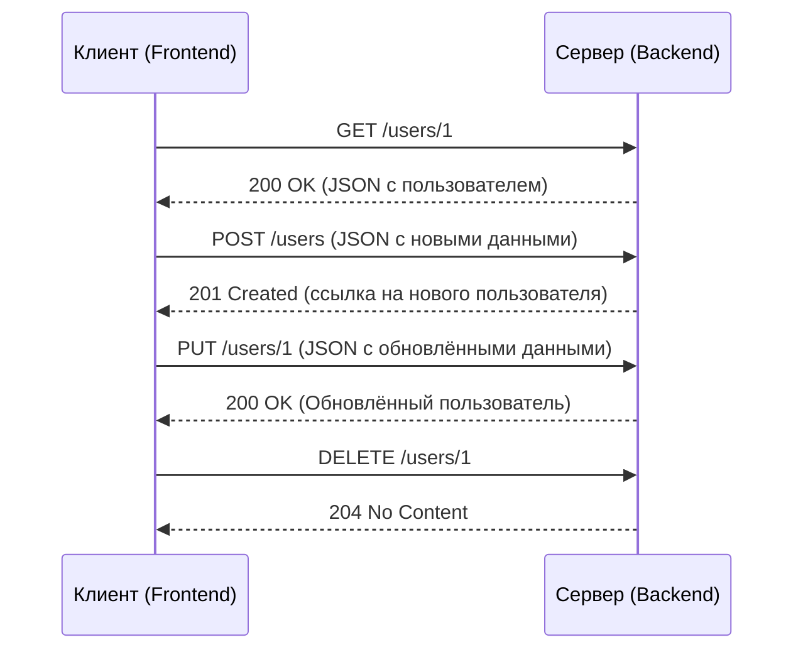

# REST/HTTP(S)

REST (**REpresentational State Transfer**) — это архитектурный стиль взаимодействия клиент-серверных систем, основанный на протоколе HTTP. Он определяет набор принципов, которым должен следовать веб-сервис, чтобы быть **RESTful** (соблюдать принципы REST).  

## Основные принципы REST

1. **Клиент-серверная архитектура**  
   - Клиент и сервер разделены. Клиент отвечает за UI, сервер за хранение данных и логику.  

2. **Отсутствие состояния (Stateless)**  
   - Сервер не хранит состояние клиента между запросами. Каждый запрос должен содержать всю необходимую информацию.  

3. **Кэшируемость**  
   - Данные могут кэшироваться клиентами и промежуточными узлами, уменьшая нагрузку на сервер.  

4. **Единообразие интерфейса**  
   - API использует предсказуемые URL и стандартные методы HTTP.  

5. **Многоуровневая система**  
   - REST API может включать прокси, балансировщики нагрузки, кэш-серверы и другие промежуточные уровни.  

6. **Код по требованию (опционально)**  
   - Сервер может отправлять исполняемый код клиенту (например, JavaScript).  

## HTTP(S) и REST

Протокол **HTTP(S)** (HyperText Transfer Protocol Secure) является основой REST API. Взаимодействие клиента и сервера происходит через **HTTP-методы**, которые представляют собой действия над ресурсами.  

Каждый HTTP-метод имеет **свои особенности**, включая идемпотентность и безопасность:  

| HTTP-метод | Описание | Идемпотентность | Безопасность |
|------------|-------------|----------------|-------------|
| **GET**    | Получение данных | ✅ Да | ✅ Да |
| **POST**   | Создание нового ресурса | ❌ Нет | ❌ Нет |
| **PUT**    | Замена ресурса | ✅ Да | ❌ Нет |
| **PATCH**  | Частичное обновление ресурса | ❌ Нет | ❌ Нет |
| **DELETE** | Удаление ресурса | ✅ Да | ❌ Нет |

### Что такое идемпотентность?

**Идемпотентность** — это свойство метода, при котором повторный вызов приводит к тому же результату, что и первый.  

- **Идемпотентные методы**: GET, PUT, DELETE  
- **Неидемпотентные методы**: POST, PATCH  

### Что означает безопасность HTTP-метода?

**Безопасность (safety)** означает, что метод **не изменяет** состояние сервера.  

- **Безопасные методы**: GET  
- **Небезопасные методы**: POST, PUT, PATCH, DELETE  

## Подробное описание HTTP-методов

### GET – Получение данных

**Описание:**  
Метод **GET** используется для запроса данных с сервера. Он **не изменяет состояние сервера** и поэтому является **безопасным** и **идемпотентным**.  

**Особенности:**  

- Только для чтения (не вносит изменений).  
- Может кэшироваться браузерами и прокси-серверами.  
- Может передавать параметры в URL (например, `GET /users?name=John`).  

**Отличие от других методов:**  

- В отличие от **POST**, не изменяет данные.  
- В отличие от **PUT, PATCH, DELETE**, не требует тела запроса.  

### POST – Создание ресурса

**Описание:**  
Метод **POST** используется для **создания нового ресурса** на сервере. Данные передаются в теле запроса.  

**Особенности:**  

- **Неидемпотентный** – повторный вызов создаст **новый** ресурс.  
- Данные отправляются в теле запроса.  
- Может возвращать `201 Created` и ссылку на созданный ресурс.  

**Отличие от других методов:**  

- В отличие от **GET**, **изменяет** состояние сервера.  
- В отличие от **PUT**, **не является идемпотентным** (повторный вызов создаёт новый ресурс, а не обновляет существующий).  

### PUT – Замена ресурса

**Описание:**  
Метод **PUT** используется для **полной замены** ресурса. Если ресурс существует – он **заменяется**, если нет – может быть **создан**.  

**Особенности:**  
- **Идемпотентный** – повторный вызов даёт одинаковый результат.  
- Ожидает **полные данные ресурса** (отправляются в теле запроса).  
- Если ресурс **не существует**, сервер может его создать (`201 Created`).  

**Отличие от других методов:**  

- В отличие от **PATCH**, требует **полных данных**.  
- В отличие от **POST**, является **идемпотентным**.  

### PATCH – Частичное обновление ресурса

**Описание:**  
Метод **PATCH** используется для **частичного обновления** ресурса (изменения отдельных полей).  

**Особенности:**  

- **Неидемпотентный** – повторный вызов **может** привести к разным результатам.  
- Позволяет отправлять **только изменённые поля**.  
- Может использоваться с **JSON Patch** или **JSON Merge Patch**.  

**Отличие от других методов:**  

- В отличие от **PUT**, не требует **полных данных**.  
- В отличие от **POST**, **не создаёт новый ресурс**.  

### DELETE – Удаление ресурса

**Описание:**  
Метод **DELETE** используется для **удаления ресурса** с сервера.  

**Особенности:**  

- **Идемпотентный** – повторный вызов приводит к одному и тому же результату (ресурса больше нет).  
- Может возвращать **204 No Content** (если успешно удалён).  
- Удаление может быть **логическим** (ресурс помечается удалённым) или **физическим**.  

**Отличие от других методов:**  

- В отличие от **GET**, изменяет состояние сервера.  
- В отличие от **PUT** и **PATCH**, удаляет ресурс.  

## RESTful API и структура URL

REST API организуется по **предсказуемым** URL:  

| Операция | URL | Метод |
|----------|-----|-------|
| Получить список пользователей | `/users` | GET |
| Получить конкретного пользователя | `/users/{id}` | GET |
| Создать нового пользователя | `/users` | POST |
| Обновить пользователя (полностью) | `/users/{id}` | PUT |
| Частично обновить пользователя | `/users/{id}` | PATCH |
| Удалить пользователя | `/users/{id}` | DELETE |

**Пример взаимодействия:**  

## Заключение

Теперь у вас есть полное понимание REST, HTTP(S) и всех его методов. 