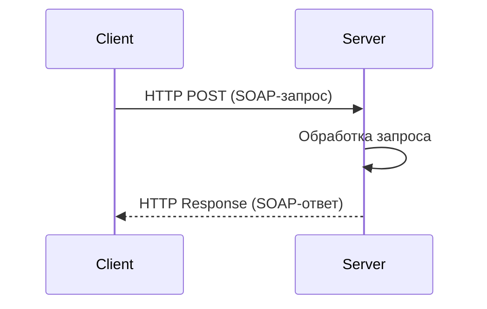

# SOAP

SOAP (Simple Object Access Protocol) — это протокол обмена сообщениями, который используется для взаимодействия между распределёнными системами. Он основан на **XML**, обеспечивает строгую типизацию и поддерживает сложные бизнес-операции.  

## Основные характеристики SOAP  

### Формат сообщений — XML

SOAP использует **XML** (Extensible Markup Language) для структурирования данных. Это делает SOAP:

- Платформонезависимым (может использоваться на Java, .NET, Python и т. д.)  
- Машиночитаемым и легко валидируемым  
- Расширяемым (можно добавлять новые элементы, не ломая схему)  

**Пример SOAP-запроса**:  

```xml
<soap:Envelope xmlns:soap="http://schemas.xmlsoap.org/soap/envelope/">
    <soap:Body>
        <GetUserInfo xmlns="http://example.com/users">
            <UserId>12345</UserId>
        </GetUserInfo>
    </soap:Body>
</soap:Envelope>
```

**Пример SOAP-ответа**:  

```xml
<soap:Envelope xmlns:soap="http://schemas.xmlsoap.org/soap/envelope/">
    <soap:Body>
        <GetUserInfoResponse xmlns="http://example.com/users">
            <User>
                <Id>12345</Id>
                <Name>Иван Иванов</Name>
                <Email>ivan@example.com</Email>
            </User>
        </GetUserInfoResponse>
    </soap:Body>
</soap:Envelope>
```

### Протокол передачи — HTTP(S), SMTP, TCP

SOAP чаще всего передаётся через **HTTP(S)**, но может использовать **SMTP** (для электронной почты) или **TCP** (для прямых соединений).  

**Пример HTTP-запроса с SOAP**:  

```http
POST /users HTTP/1.1
Host: example.com
Content-Type: text/xml; charset=utf-8
SOAPAction: "http://example.com/GetUserInfo"

<soap:Envelope xmlns:soap="http://schemas.xmlsoap.org/soap/envelope/">
    <soap:Body>
        <GetUserInfo xmlns="http://example.com/users">
            <UserId>12345</UserId>
        </GetUserInfo>
    </soap:Body>
</soap:Envelope>
```

**Пример HTTP-ответа с SOAP**:  

```http
HTTP/1.1 200 OK
Content-Type: text/xml; charset=utf-8

<soap:Envelope xmlns:soap="http://schemas.xmlsoap.org/soap/envelope/">
    <soap:Body>
        <GetUserInfoResponse xmlns="http://example.com/users">
            <User>
                <Id>12345</Id>
                <Name>Иван Иванов</Name>
                <Email>ivan@example.com</Email>
            </User>
        </GetUserInfoResponse>
    </soap:Body>
</soap:Envelope>
```

### Строгая типизация и валидация

SOAP использует **XSD (XML Schema Definition)** для строгой валидации данных.  

**Пример XSD-схемы SOAP-сообщения**:  

```xml
<xs:schema xmlns:xs="http://www.w3.org/2001/XMLSchema">
    <xs:element name="GetUserInfo">
        <xs:complexType>
            <xs:sequence>
                <xs:element name="UserId" type="xs:int"/>
            </xs:sequence>
        </xs:complexType>
    </xs:element>
</xs:schema>
```

Если передать `UserId` в неверном формате (например, строку вместо числа), SOAP-сервер вернёт ошибку.

## WSDL (Web Services Description Language)  

WSDL (Web Services Description Language) — это XML-документ, описывающий API SOAP-сервиса. Он определяет:

- **Методы (Operations)**  
- **Типы данных (Types)**  
- **Протоколы (Bindings)**  
- **Адрес сервиса (Service Location)**  

**Пример WSDL-документа**:  

```xml
<definitions xmlns="http://schemas.xmlsoap.org/wsdl/" 
    xmlns:tns="http://example.com/service" 
    xmlns:xsd="http://www.w3.org/2001/XMLSchema"
    xmlns:soap="http://schemas.xmlsoap.org/wsdl/soap/"
    targetNamespace="http://example.com/service">

    <message name="GetUserInfoRequest">
        <part name="UserId" type="xsd:int"/>
    </message>

    <message name="GetUserInfoResponse">
        <part name="User" type="xsd:string"/>
    </message>

    <portType name="UserPortType">
        <operation name="GetUserInfo">
            <input message="tns:GetUserInfoRequest"/>
            <output message="tns:GetUserInfoResponse"/>
        </operation>
    </portType>

    <binding name="UserBinding" type="tns:UserPortType">
        <soap:binding style="document" transport="http://schemas.xmlsoap.org/soap/http"/>
        <operation name="GetUserInfo">
            <soap:operation soapAction="http://example.com/GetUserInfo"/>
            <input><soap:body use="literal"/></input>
            <output><soap:body use="literal"/></output>
        </operation>
    </binding>

    <service name="UserService">
        <port name="UserPort" binding="tns:UserBinding">
            <soap:address location="http://example.com/service"/>
        </port>
    </service>
</definitions>
```

Этот документ описывает сервис `UserService`, который имеет метод `GetUserInfo`, принимающий `UserId` и возвращающий информацию о пользователе.

## XML в SOAP  

SOAP-сообщения полностью основаны на XML, который определяет структуру данных.  

**Основные правила XML**:

- Все данные заключены в **теги**  
- Атрибуты хранят **метаданные**  
- Должен быть **один корневой элемент**  
- **Закрытые теги** обязательны  

**Пример SOAP-запроса с XML**:  

```xml
<soap:Envelope xmlns:soap="http://schemas.xmlsoap.org/soap/envelope/">
    <soap:Body>
        <OrderRequest xmlns="http://example.com/orders">
            <OrderId>56789</OrderId>
            <Customer>
                <Name>Анна Смирнова</Name>
                <Email>anna@example.com</Email>
            </Customer>
        </OrderRequest>
    </soap:Body>
</soap:Envelope>
```

## Диаграмма взаимодействия SOAP  



- Клиент отправляет **SOAP-запрос**  
- Сервер обрабатывает и **возвращает ответ**  

## PSD (Process Service Descriptor)  

В контексте SOAP PSD (Process Service Descriptor) **не является стандартным термином**. Чаще всего используется в BPM (Business Process Management) для описания бизнес-процессов. Если вам нужно подробнее разобрать этот аспект, уточните ваш запрос.

## Заключение
SOAP — это мощный и надёжный способ интеграции сервисов, но требует строгой структуры и более сложен, чем REST. Он хорошо подходит для корпоративных решений, требующих безопасности, транзакционности и строгого контракта API.
