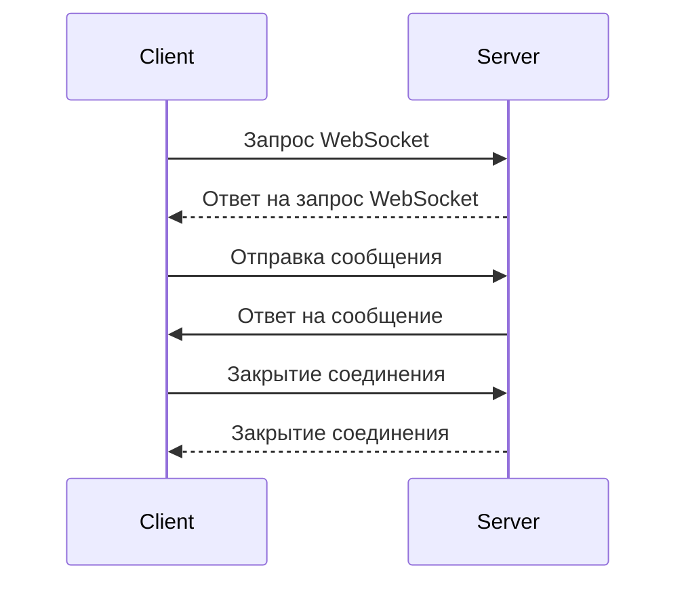

# WebSockets

WebSockets — это протокол связи, предоставляющий двустороннюю, полноценно открываемую, постоянную связь между клиентом и сервером. Он часто используется в ситуациях, когда требуется мгновенная передача данных, например, в чатах, игровых приложениях, или для систем с реальным временем, таких как мониторинг или финансовые платформы.

## Основные особенности WebSockets

1. **Двунаправленная связь**: В отличие от HTTP, WebSocket позволяет как клиенту, так и серверу отправлять сообщения в любую сторону в любое время.
2. **Установление соединения**: При первом запросе клиент делает HTTP-запрос для "апгрейда" соединения на WebSocket. После успешного апгрейда, соединение остаётся открытым, и обмен данными может происходить без дополнительных запросов.
3. **Снижение накладных расходов**: После установления соединения между клиентом и сервером, все сообщения передаются с минимальными заголовками, что снижает накладные расходы по сравнению с обычными HTTP-запросами.
4. **Долгоживущие соединения**: WebSocket-соединение может оставаться открытым в течение длительного времени (до тех пор, пока одна из сторон не закроет соединение).

## Структура WebSocket-сообщений

WebSocket-сообщения имеют следующие компоненты:

- **Frame** — структура данных в WebSocket, которая может быть текстовой или бинарной.
- **Payload** — полезная нагрузка, которая содержит данные, передаваемые через WebSocket.

Сообщения могут быть:

- **Текстовые**: передаются в формате UTF-8.
- **Бинарные**: могут быть переданы в двух форматах: как данные в формате Blob или ArrayBuffer.

## Установление соединения WebSocket

Пример установления соединения на клиенте:

```javascript
const socket = new WebSocket('ws://example.com/socket');
socket.onopen = () => {
  console.log('Соединение открыто');
};
socket.onmessage = (event) => {
  console.log('Получено сообщение: ' + event.data);
};
socket.onclose = () => {
  console.log('Соединение закрыто');
};
socket.onerror = (error) => {
  console.log('Ошибка: ' + error.message);
};
```

- **`ws://example.com/socket`**: адрес WebSocket-сервера.
- **`onopen`**: срабатывает при успешном установлении соединения.
- **`onmessage`**: срабатывает, когда сервер отправляет сообщение.
- **`onclose`**: срабатывает, когда соединение закрывается.
- **`onerror`**: срабатывает, когда возникает ошибка.

Пример на сервере (Node.js с использованием библиотеки `ws`):

```javascript
const WebSocket = require('ws');
const wss = new WebSocket.Server({ port: 8080 });

wss.on('connection', (ws) => {
  console.log('Новое соединение');
  ws.on('message', (message) => {
    console.log('Получено сообщение: ' + message);
  });
  ws.send('Добро пожаловать на сервер!');
});
```

## Пример взаимодействия



## Протокол WebSocket

Протокол WebSocket использует **TCP** для транспортировки данных, и в отличие от HTTP, который использует запросы и ответы, WebSocket использует одно соединение для двустороннего обмена данными. Стандарт WebSocket работает на порту **80 (ws)** и **443 (wss)**, при этом **wss** является зашифрованной версией WebSocket, которая использует SSL/TLS.

## Протокол обмена WebSocket (Ручка рукопожатия)

1. Клиент отправляет запрос на сервер с заголовком `Upgrade` для переключения на WebSocket.

   Пример HTTP-запроса на установку WebSocket-соединения:

   ```http
   GET /socket HTTP/1.1
   Host: example.com
   Upgrade: websocket
   Connection: Upgrade
   Sec-WebSocket-Key: x3JJHMbDL1EzLkh9d8
   Sec-WebSocket-Version: 13
   ```

2. Сервер отвечает с подтверждением апгрейда:

   Пример HTTP-ответа:

   ```http
   HTTP/1.1 101 Switching Protocols
   Upgrade: websocket
   Connection: Upgrade
   Sec-WebSocket-Accept: HSmxxnC4T35F5s5zZf==
   ```

После этого установлено соединение WebSocket, и обмен данными может быть выполнен через frames.

## Закрытие соединения

Когда одно из соединений решает закрыть соединение, оно отправляет специальный фрейм с кодом завершения, а другое соединение подтверждает закрытие.

Пример фрейма закрытия:

- Код 1000: нормальное завершение.
- Код 1001: сервер завершил соединение.
- Код 1002: ошибка протокола.

Пример на клиенте для закрытия соединения:

```javascript
socket.close(1000, 'Завершаю соединение');
```

Пример на сервере для закрытия соединения:

```javascript
ws.close(1000, 'Завершаю соединение');
```

## Преимущества и недостатки WebSockets

**Преимущества:**

1. **Долгосрочные соединения** — подходит для приложений, требующих постоянной связи.
2. **Низкие задержки** — обмен данными происходит мгновенно, без необходимости повторных запросов.
3. **Минимальные накладные расходы** — после установления соединения обмен сообщениями осуществляется с минимальными заголовками.

**Недостатки:**

1. **Нет гарантии доставки** — WebSocket не обеспечивает надежную доставку сообщений.
2. **Не подходит для всех типов приложений** — WebSockets лучше подходят для приложений в реальном времени, а не для традиционных веб-сайтов.
3. **Загрузка серверов** — так как соединение поддерживается постоянно, серверы должны обрабатывать множество открытых соединений.

## Когда использовать WebSockets?

- В чатах и мессенджерах.
- Для приложений в реальном времени, например, финансовых платформ.
- В онлайн-играх для обмена сообщениями между клиентами.
- Для передачи данных в системах мониторинга в реальном времени.

Этот протокол предоставляет множество преимуществ в сценариях с высоким объёмом взаимодействий в реальном времени.
